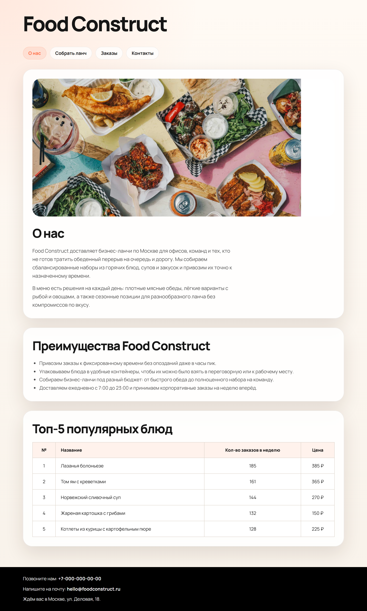
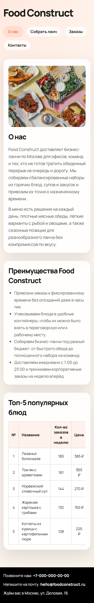
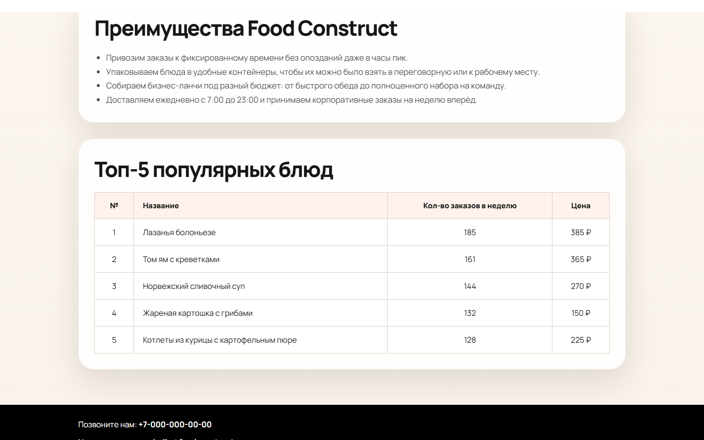

# Лабораторная работа № 1

Реализована главная страница Food Construct на чистом HTML и CSS.  
Подключён Google Font, собраны обязательные секции, таблица популярных блюд, якорь на контакты и рабочая навигация.

Проверки:
- десктопный и мобильный рендер через Playwright
- `npx --yes html-validate index.html menu.html order.html` без ошибок

## Скриншоты

