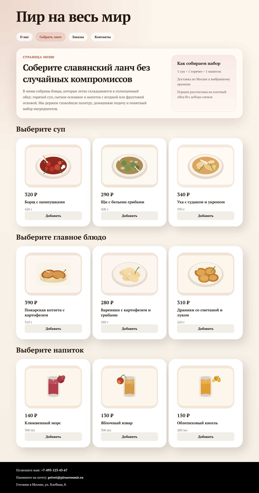
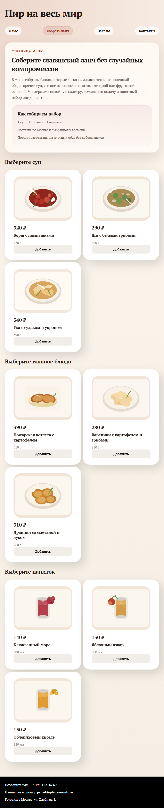
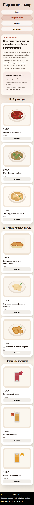
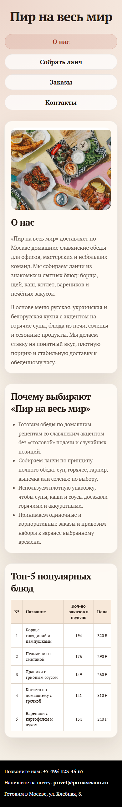

# Лабораторная работа № 2

Сделана страница «Собрать ланч» в славянской тематике: карточки блюд, сетка на CSS Grid, карточки на Flex, отдельные стили `menu.css`, печатные стили `print.css`, адаптив для меню и главной.

Проверки:
- `npx --yes html-validate index.html menu.html order.html` без ошибок
- локальный рендер через Playwright на desktop, tablet и mobile

## Скриншоты

