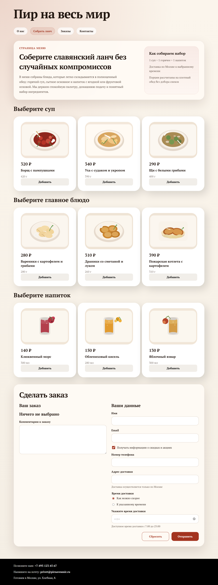
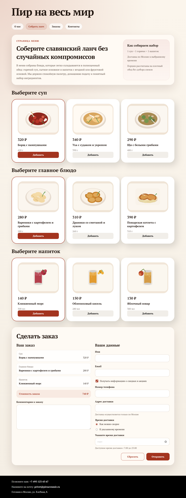

# Лабораторная работа № 4

Карточки блюд переведены на динамическую генерацию через JavaScript: данные вынесены в отдельный файл, карточки сортируются по алфавиту, при выборе блюда обновляется блок «Ваш заказ», подсвечиваются выбранные карточки и пересчитывается стоимость.

Проверки:
- `npx --yes html-validate index.html menu.html order.html` без ошибок
- браузерный рендер и demo-состояние с выбранными блюдами через Playwright

## Скриншоты

