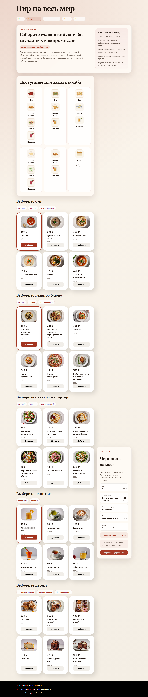
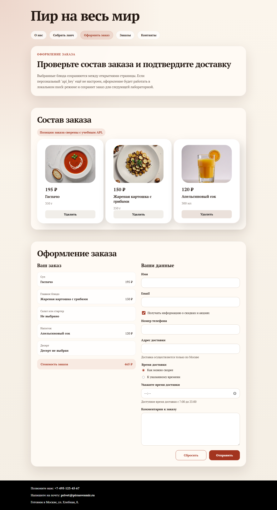
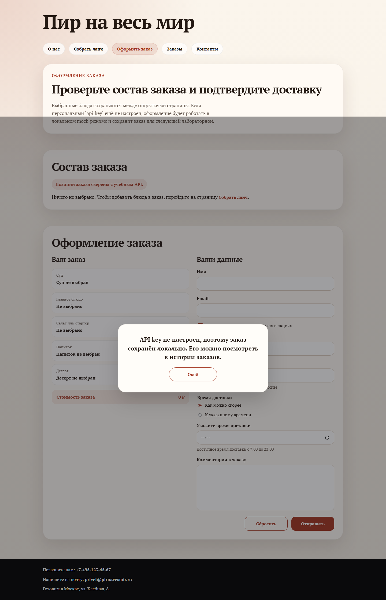

# Лабораторная работа № 8

На странице меню оформление вынесено в отдельный шаг: выбранные блюда сохраняются в `localStorage`, справа показывается закреплённый черновик заказа, а заполнение данных перенесено на `checkout.html`. Отправка заказа работает через общий API-слой и в текущей сборке автоматически переходит в локальный mock-режим, если персональный `api_key` не задан.

Проверки:
- `npx --yes html-validate index.html menu.html checkout.html order.html` без ошибок
- Playwright smoke test: выбор блюд, переход в checkout, отправка заказа и сохранение в локальной истории

## Скриншоты

