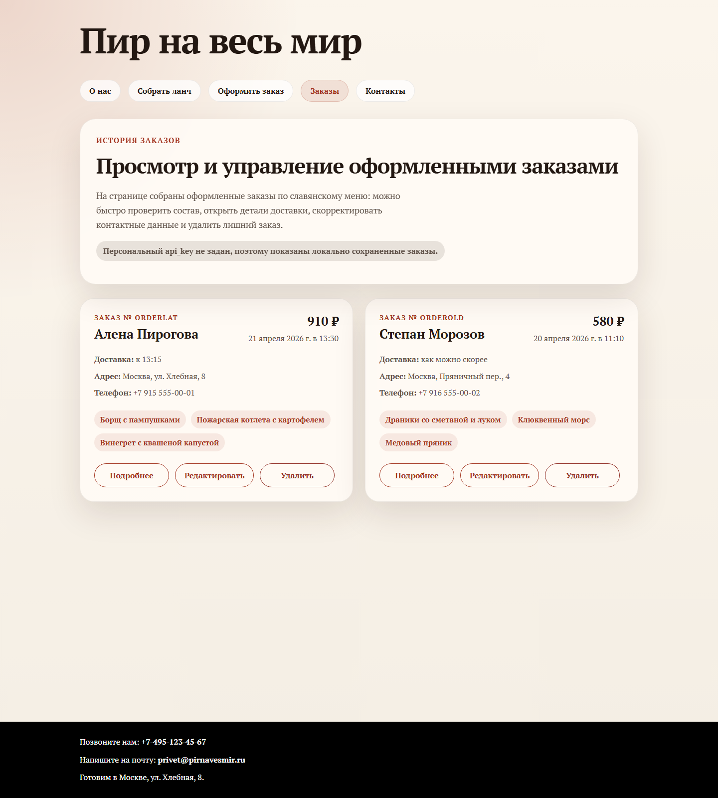
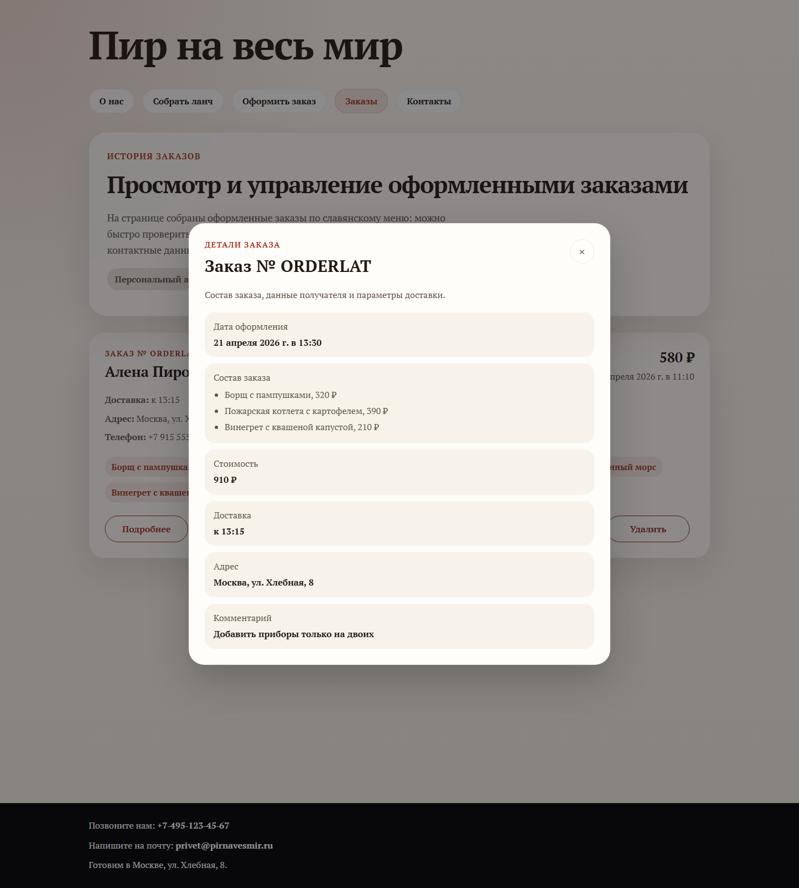
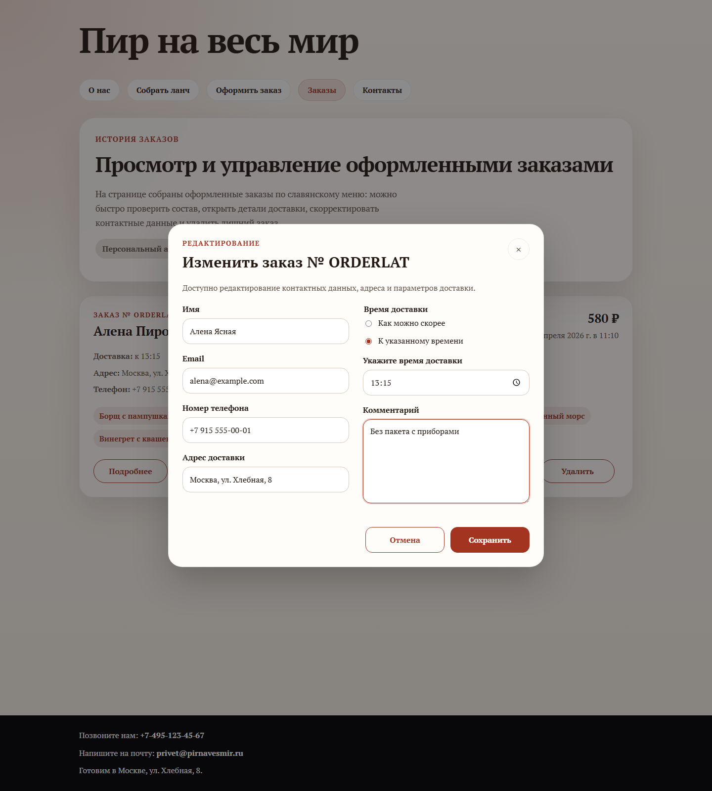

# Лабораторная работа № 9

`order.html` превращена в страницу истории заказов: записи сортируются от новых к старым, для каждого заказа показаны состав, стоимость и параметры доставки, а управление вынесено в модальные окна. В mock-режиме страница работает поверх локального хранилища и поддерживает просмотр, редактирование и удаление без изменения общей структуры приложения.

Проверки:
- `npx --yes html-validate index.html menu.html checkout.html order.html` без ошибок
- Playwright smoke test: загрузка истории, открытие деталей, редактирование и удаление заказа

## Скриншоты

