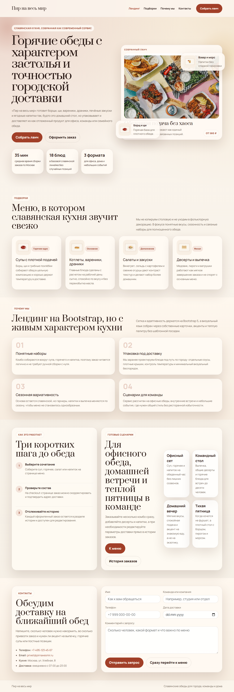
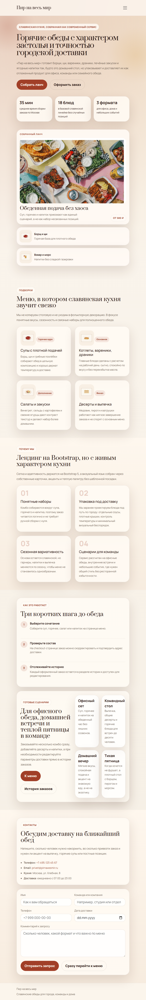
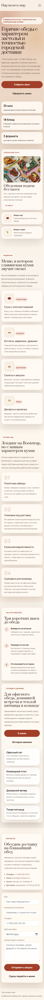

# Лабораторная работа № 10

Добавлен отдельный адаптивный Bootstrap 5 лендинг `landing.html` с акцентом на славянскую кухню: hero-блок, подборки меню, преимущества, сценарий заказа и контактная форма. Страница встроена в проект через общую навигацию, но визуально отличается от предыдущих лабораторных за счет собственной палитры, типографики и карточной композиции.

Проверки:
- `npx --yes html-validate index.html menu.html checkout.html order.html landing.html` без ошибок
- Playwright smoke test на трех ширинах экрана: desktop, tablet и mobile

## Скриншоты

